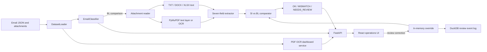

# Averish Shipping AI

An inbox-to-discrepancy-report prototype for shipping operations. It finds emails asking for a document check, compares a Shipping Instruction (SI) with a draft Bill of Lading (BL), and shows the evidence a reviewer needs to act.

## Problem statement

Shipping teams receive document checks, new SI requests, invoice questions, operational updates, and spam in the same inbox. Staff must first find the requests that need verification, then compare the SI (the reference) against the draft BL. Manual checks are repetitive, and a missed difference in a name, port, container count, or weight can cause corrections and delays. The same field may also have different labels or formatting in the two documents. The supplied use case asks for classification, seven-field comparison, a clear discrepancy report, and human review when the evidence is incomplete or unreliable.

## Solution

The application provides a searchable operations inbox and a verification pipeline:

- A rule-based classifier sorts emails into `BL_COMPARISON`, `SI_REQUEST`, `INVOICE_QUERY`, `GENERAL`, and `SPAM`. Only comparison requests proceed to SI/BL checking.
- The attachment reader supports TXT, PDF, DOCX, and XLSX. PyMuPDF reads searchable PDF text and calls Tesseract OCR through PyMuPDF for pages with too little text. The repository includes an English OCR language model.
- A field extractor maps varied document labels to seven shipment fields: shipper, consignee, notify party, port of loading, port of discharge, container count, and gross weight in kilograms.
- The comparator uses the SI as the reference and reports `OK`, `MISMATCH`, or `NEEDS_REVIEW`. Its field matrix shows SI and BL values side by side and identifies exact, normalized, or fuzzy matches.
- Cases with missing attachments, unreadable files, wrong document types, or missing required values go to human review. A reviewer can correct extracted fields and rerun the comparison.

The React interface includes the inbox, SI/BL inspector, human review queue, shipment timeline, vessel calendar, analytics, a self-evaluation view, and a PDF OCR dashboard at `/dashboard`. It has light and dark themes.

## Project flow

1. Load email JSON records and referenced attachments from `test data/` (or the bundled fallback data).
2. Classify each email using its subject, body, and attachment metadata.
3. For a comparison request, identify the SI and draft BL, read their text, and extract the seven fields.
4. Check attachment and field completeness before comparing values. Escalate uncertain cases with a reason.
5. Compare each BL field against its SI counterpart. Show the outcome, differing fields, source text, and suggested next step in the inspector.
6. Let a reviewer correct a value when needed; recompute the result and record a correction event when DuckDB is available.

## System architecture



The backend is Python/FastAPI; the frontend is React, Vite, and Tailwind CSS. Original attachments remain on disk. Extracted attachment text and PDF results are cached in the backend process, while reviewer overrides are held in memory. These caches and overrides reset on restart. The optional DuckDB event log supports timeline and review history; it is not the store for extracted text.

## Wow factor

- **Evidence-first discrepancy view:** Each of the seven checks shows the SI reference, BL value, and match type, so a reviewer can see exactly what differed.
- **Useful escalation:** Missing or unreadable evidence becomes `NEEDS_REVIEW` with a reason, rather than an ungrounded match decision.
- **Mixed-format intake:** The same pipeline handles text files, office documents, searchable PDFs, and scanned PDF pages.
- **OCR observability:** `/dashboard` lists PDF attachments by email number, the extracted text, processing method, field coverage, and an OCR agreement benchmark where a searchable text layer exists.
- **Operations context:** The inbox, review queue, timeline, calendar, and analytics connect document checks to day-to-day shipment work.

## How to run

Requirements: Python 3.11+ and Node.js with npm. Run these commands from the repository root.

```bash
python -m venv .venv
# Windows PowerShell: .venv\Scripts\Activate.ps1
# macOS/Linux: source .venv/bin/activate
python -m pip install -r requirements.txt
cd frontend
npm install
cd ..
python run_app.py
```

Open `http://localhost:3000` for the app, `http://localhost:3000/dashboard` for the OCR dashboard, and `http://localhost:8000/docs` for the API documentation. `run_app.py` starts FastAPI on port 8000 and Vite on port 3000; stop it with Ctrl+C. If PowerShell blocks venv activation, use `.venv\Scripts\python.exe` for the Python commands.

The repository also has a Docker Compose option for the **API only**:

```bash
docker compose up --build
```

That serves FastAPI at `http://localhost:8080`. It does not start the React frontend. To run the frontend alongside it, start the local API on port 8000 as above, or adjust the Vite proxy in `frontend/vite.config.js` to port 8080.

For a frontend build check, run `cd frontend && npm run build`. The backend tests use FastAPI's test client; depending on the installed Starlette version, they may also require the `httpx2` package before `python -m unittest discover -s tests` can run.

## Challenges faced and current limits

- **Different labels and formatting:** SI and BL documents can express the same field differently. The extractor and comparator normalize common variants, but unusual layouts can still require review.
- **Scanned pages:** OCR can read image-only PDFs, but the supplied scans have no verified transcripts. The dashboard's accuracy percentage compares OCR output with existing searchable PDF text where available; it is a proxy benchmark, not measured accuracy on scanned pages. Field coverage measures completeness, not correctness.
- **Incomplete evidence:** Missing or damaged attachments and absent required values must be surfaced clearly. The comparison gate sends these to review instead of silently marking them as matches.
- **Validation:** The local self-evaluation view summarizes the app's own output. It does not use the organizers' private answer key, and its displayed score is not an independently measured classification or defect F1 score.
- **Prototype state:** The main request path is synchronous, and reviewer overrides plus extraction caches are process-local. Restarting the backend clears them.

## Future plan

1. Persist reviewer decisions and extracted evidence in a durable store, with a traceable link to each source document and field.
2. Add verified transcripts for scanned PDFs and evaluate OCR with real character/word error rates; expand coverage to harder layouts and languages.
3. Compare the generated submission with the organizers' private evaluator when available, then tune classification and mismatch rules against actual false positives and misses.
4. Move document processing to background jobs with progress, retries, and visible failure states.
5. Expand reviewer workflows and access controls before using the system with live operational inboxes.

## Project map

| Path | Purpose |
| --- | --- |
| `backend/main.py` | FastAPI routes and workflow orchestration |
| `backend/services/` | Data loading, classification, extraction, comparison, OCR, evaluation, and timeline services |
| `frontend/src/` | React operations interface |
| `test data/` | Supplied email and attachment dataset |
| `tests/` | Backend workflow and OCR tests |
