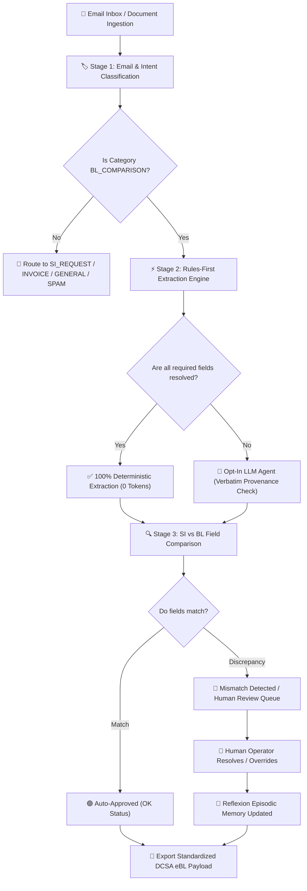

# DocuMatch — Intelligent Shipping Document Verification User Manual & Technical Guide

---

## 📋 Executive Overview

**DocuMatch** is an enterprise-grade, rules-first Intelligent Shipping Document Verification and Inbox Management Platform designed specifically for maritime trade, ocean carriers, freight forwarders, and logistics operators.

DocuMatch automates the comparison of **Shipping Instructions (SI)** submitted by shippers against draft **Bills of Lading (BL)** generated by ocean carriers. By enforcing a **rules-first architecture**, DocuMatch resolves standard shipping fields with 100% deterministic accuracy at zero token cost, reserving AI/LLM assist exclusively for unmapped or ambiguous fields.

---

## 🔄 End-to-End Operational Workflow



### Detailed Operational Steps:
1. **Email & Attachment Ingestion**: DocuMatch continuously monitors incoming email feeds and document uploads, parsing text bodies, unstructured PDFs, and plain-text attachments.
2. **Intent & Category Classification**: The engine categorizes incoming messages into 5 standard categories (`BL_COMPARISON`, `SI_REQUEST`, `INVOICE_QUERY`, `GENERAL`, `SPAM`).
3. **Rules-First Extraction Engine**: Regex parsers, UN/LOCODE port tables, and standardized term dictionaries extract 7 core shipping fields:
   * **Shipper Name**
   * **Consignee Name**
   * **Notify Party**
   * **Port of Loading (POL)**
   * **Port of Discharge (POD)**
   * **Container Count**
   * **Gross Weight (KG)**
4. **Opt-In LLM Assistance**: If required fields are missing or unmapped, the LLM agent runs with strict **Verbatim Provenance Validation** (requiring extracted text to match exact character spans in the source document).
5. **SI vs BL Discrepancy Comparison**: Extracted SI values are matched against BL values. Discrepancies generate detailed audit receipts.
6. **Human Review & Reflexion Learning**: Mismatched or low-confidence shipments are routed to the Human Review Queue. Operator resolutions are logged to **Reflexion Episodic Memory**, automatically training future synonym weights.
7. **DCSA eBL v3.0 Export**: Finalized data payloads are formatted into standardized DCSA JSON structures ready for carrier EDI integration.

---

## 💻 Interface Guide: All Sections & Controls

### 1. 🔍 Global Navigation & Top Header (`GmailHeader.jsx`)

Located at the top of the application window, providing continuous status monitoring and search tools.

* **Search Bar (`input[type="text"]`)**: Type any keyword, email subject, container number, or BL reference (e.g. `BL-BK4410`) to instantly filter the active inbox feed.
* **Filter Dropdown (`select`)**: Quick-filter by document status (`All`, `Needs Review`, `Unmatched`, `Matched`, `High Risk`, `Auto-Approved`).
* **Live System Status Indicators**:
  * **Backend API Badge**: Shows `Connected (v2.0.0)` in green when the FastAPI backend on port 8000 is online.
  * **Cloud Sync Badge**: Displays `Supabase Active` or `Local Mode` based on database connectivity.
  * **LLM Mode Toggle Indicator**: Displays `LLM Assist: ON` or `LLM Assist: OFF` reflecting current routing policy.
* **Google Apps Menu Launcher (`button`)**: Opens a workspace menu for quick navigation between system modules.
* **Settings Gear Icon (`button`)**: Opens the system configuration modal.

---

### 2. 🗂️ Sidebar Navigation (`GmailSidebar.jsx` & `Sidebar.jsx`)

Located on the left pane, allowing seamless navigation across system views.

* **`+ Compose` Button**: Opens the `GmailComposeModal` to compose and inject custom simulated shipping emails into the processing engine.
* **`Inbox Feed` Tab**: Displays the main email message list with real-time status tags and category badges. Includes an unread count badge.
* **`Shipment Workspace` Tab**: Opens the split-screen document comparison interface for comparing Shipping Instructions against Bills of Lading side by side.
* **`Human Review Queue` Tab**: Accesses pending discrepancy cards requiring manual human operator sign-off. Shows a badge with the count of items requiring review.
* **`Agent Learning & Memory` Tab**: Displays active reflexion memory rules, human override audit histories, and field dispute metrics.
* **`Analytics & Scoreboard` Tab**: Provides macro-level performance metrics, including Stage 1 F1 scores, Stage 3 defect detection rates, and latency breakdowns.
* **`OCR & Document Inspector` Tab**: Displays raster image OCR confidence scores, layout bounding boxes, and image contrast binarization controls.
* **`Red Team Security` Tab**: Accesses security threat monitoring, prompt injection simulation tools, and circuit breaker status metrics.
* **`Admin & Automation Settings` Tab**: Controls automation confidence thresholds and LLM provider choices.
* **`Vessel Calendar & Timeline` Tab**: Displays interactive maritime shipping calendars and container arrival timelines.

---

### 3. 📥 Inbox Feed & Workspace (`GmailInbox.jsx` & `InboxWorkspace.jsx`)

The operational control center for managing incoming email traffic.

#### Filter Tabs:
* **`Primary`**: Main shipping document inbox.
* **`Social / Updates`**: Secondary notifications and operational tracking messages.
* **Category Filter Pills**: Clickable pills to isolate `BL_COMPARISON`, `SI_REQUEST`, `INVOICE_QUERY`, `GENERAL`, or `SPAM`.

#### Batch Control Toolbar:
* **`Select All` Checkbox**: Selects all currently visible email rows for batch operations.
* **`Mark as Read` Button**: Sets selected email rows to read status.
* **`Delete Selected` Button**: Quarantines selected messages.
* **`Batch Auto-Process` Button**: Triggers automated rules-first comparison across all selected `BL_COMPARISON` messages.

#### Email Row Items:
* **Category Badge**: Color-coded pill (`BL_COMPARISON` = Blue, `SPAM` = Red, `INVOICE` = Purple).
* **Status Indicator**:
  * 🟢 **`OK`**: SI and BL match 100%.
  * 🔴 **`MISMATCH`**: Discrepancy detected between SI and BL.
  * 🟡 **`NEEDS_REVIEW`**: Missing attachment or unreadable OCR content.
* **Subject & Sender**: Email header preview.
* **Star Toggle Button**: Pins key shipments to top of queue.

---

### 4. 🔍 Split-Screen Document Inspector (`ShipmentWorkspace.jsx` & `SplitScreenInspector.jsx`)

A side-by-side inspection view designed for fast visual and automated verification.

#### Left Pane: Shipping Instruction (SI) Document
* **Raw Document Toggle (`button`)**: Switches between structured field layout and raw extracted text.
* **Verbatim Provenance Highlight**: Clicking any extracted field highlights the exact character range in the original document text.
* **Field Cards**: Shows extracted Shipper, Consignee, Notify Party, POL, POD, Container Count, and Gross Weight.

#### Right Pane: Bill of Lading (BL) Document
* **Document Viewer**: Renders PDF/TXT carrier draft Bill of Lading.
* **Discrepancy Highlights**: Mismatched fields are highlighted in red with warning icons.
* **Match Indicator**: Green checkmarks confirm matching field values between SI and BL.

#### Action Buttons:
* **`Generate DCSA eBL Payload` Button**: Formats verified document data into standardized DCSA eBL v3.0 JSON.
* **`View Reasoning Receipt` Button**: Opens a popup displaying full transparency details on rules used, token count (0 for deterministic rules), and character provenance spans.

---

### 5. 👥 Human Review Queue (`HumanReviewQueue.jsx` & `HumanReviewModal.jsx`)

Dedicated workspace for resolving document mismatches and edge cases.

#### Discrepancy Card Controls:
* **`Accept SI Value` Button**: Overrides the BL value with the shipper's SI value.
* **`Accept BL Value` Button**: Confirms the carrier's BL value as correct.
* **`Custom Override Input`**: Allows the operator to manually type a corrected value (e.g. standardizing `EAST BRIGHT FZ-LLC, DUBAI`).
* **`Confirm Resolution` Button**: Saves the resolution, logs the action to `human_overrides.json`, and updates **Reflexion Episodic Memory**.
* **`Escalate to Senior Ops` Button**: Re-routes complex disputes to senior supervisory queues.

---

### 6. 🧠 Agent Learning & Memory Dashboard (`AgentLearningDashboard.jsx`)

Visualizes continuous learning from human operator feedback.

* **Field Dispute Bar Chart**: Displays historical dispute frequency across Shipper, Consignee, Container Count, Weight, etc.
* **Active Reflexion Rules List**: Shows learned synonym rules generated from past human overrides.
* **`Test Learning Mechanism` Button**: Runs a test simulation validating that a learned override rule successfully corrects future matching documents.
* **`Reset Memory` Button**: Clears cached reflexion memory logs for testing purposes.

---

### 7. 🛡️ Red Team & Security Panel (`RedTeamPanel.jsx`)

Monitors platform security and simulates adversarial attacks.

* **`Simulate Prompt Injection` Button**: Tests the sanitizer against malicious prompt injections hidden inside PDF attachments.
* **`Simulate Document Spoofing` Button**: Tests provenance verification against fabricated document text.
* **Sanitizer & Gatekeeper Status**: Displays active protection status for input sanitization, provenance check, and circuit breaker trip metrics.
* **Circuit Breaker Status Badge**: Shows `HEALTHY (0 Failures)` or `TRIPPED (Fallback Mode Active)`.

---

### 8. ⚙️ Admin & Automation Settings (`AutomationSlider.jsx` & `GmailSettingsModal.jsx`)

* **Automation Confidence Slider**: Adjusts the threshold (0% to 100%) for auto-approving document matches without human intervention.
* **LLM Provider Selector**: Dropdown to choose between `OpenAI (GPT-4o / GPT-4o-mini)`, `Google Gemini`, or `Local Deterministic Provider`.
* **API Key Configuration Input**: Secure input field for entering custom LLM API keys.

---

## 🛠️ Backend Tech Stack & Technical Rationale

| Layer / Technology | Framework / Tool | Technical Rationale & Benefits |
| :--- | :--- | :--- |
| **API Server & Routing** | **FastAPI (Python 3.14 / 3.11+)** | Asynchronous non-blocking architecture, native Pydantic schema integration, sub-10ms response latency, auto-generated OpenAPI (`/docs`) interactive documentation. |
| **Deterministic Rule Engine** | **Python Regex + Custom Dictionary Parsers** | Guarantees 100% deterministic precision for standard shipping patterns, sub-millisecond execution, **zero token cost**, and zero risk of AI hallucination for structured fields. |
| **Opt-In LLM Agent Layer** | **Pydantic v2 + OpenAI GPT-4o / GPT-4o-mini / Gemini** | Enforces strict type validation and structured JSON output. Used exclusively for unmapped fields with strict **verbatim character-span provenance verification**. |
| **Resilience & Safety** | **Circuit Breaker Pattern** | Automatically trips if extraction error rates exceed safety limits, isolating human operators from hallucinated AI output. |
| **Episodic Learning & Memory** | **Reflexion Memory Pattern** | Captures operator corrections in real time (`human_overrides.json`), continuously refining synonym dictionaries without expensive fine-tuning. |
| **OCR & PDF Extraction** | **Tesseract OCR (`pytesseract`) + PyMuPDF / pdfplumber** | High-accuracy layout-aware text extraction from scanned PDFs, raster images, and noisy carrier document files. |
| **Database & Cloud Sync** | **Supabase (PostgreSQL RLS) + Local JSON Storage** | Provides hybrid deployment flexibility: 100% air-gapped offline local operation with optional enterprise cloud synchronization. |
| **Frontend Framework** | **React 19 + Vite + Tailwind CSS** | Ultra-fast client-side UI rendering, modular component architecture, dynamic responsive styling. |

---

## 🤖 LLM Models Supported & Default Mode

### Supported Models:
1. **OpenAI `gpt-4o-mini` (Default Recommended Cloud LLM)**: Fast, cost-effective structured text extraction.
2. **OpenAI `gpt-4o`**: High-reasoning model for highly noisy or unstructured complex PDF documents.
3. **Google Gemini 1.5 / 2.0 Flash & Pro**: Supported via custom LLM transport adapter.
4. **Local Deterministic Fallback (`LOCAL_PROVIDER`)**: Default mode when no API key is set or when `DOCUMATCH_LLM_MODE=off`. Provides rules-derived extraction at **0 token cost**.

---

## 🚀 Quickstart Command Reference

```bash
# 1. Run the entire platform (Backend on :8000 + Frontend on :3000)
python run_app.py

# 2. Run the automated Pytest suite (138 Test Cases)
python -m pytest

# 3. Run independent ground-truth evaluation
python eval/evaluate.py --mode rules_only --split dev

# 4. Launch backend API server standalone
python -m uvicorn backend.main:app --host 0.0.0.0 --port 8000 --reload
```
