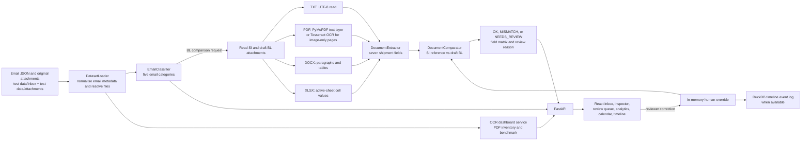

# Shipping Document Verification — Implemented Architecture

This document describes the workflow running on the `OCR` branch. It is based on the
FastAPI routes, service calls, and React views in this repository.

## System flow

The classifier reads the email subject, body, and attachment metadata. Only emails
classified as BL comparison requests proceed to SI and draft BL comparison. The SI is
the reference for the seven required fields: shipper, consignee, notify party, port
of loading, port of discharge, container count, and gross weight in kilograms.

## Attachment handling

`backend/services/dataset_loader.py` reads files when an API request or evaluation
needs them. TXT files are decoded as UTF-8. DOCX paragraphs and table cells are
flattened into lines. XLSX uses the active sheet's stored cell values. For PDFs,
`backend/services/pdf_ocr.py` reads an existing text layer with PyMuPDF; pages with
little searchable text are processed with PyMuPDF's Tesseract OCR using the bundled
English language model. Damaged or unreadable attachments receive an error marker
that sends the comparison to human review.

Extracted text is retained in the backend process's attachment-text cache. PDF
results also use a cache keyed by file path, modification time, and size. The
original files stay in `test data/attachments`. Extracted text is not written to
a separate database or output file. The email detail API sends SI and BL text to
the split-screen inspector; `/api/ocr/dashboard` returns full text for PDF
attachments to `/dashboard`.

## Decisions and review

`backend/services/extractor.py` converts attachment text into the seven shipment
fields. `backend/services/comparator.py` checks each SI value against its draft
BL counterpart. It reports mismatched fields and both values. Missing attachments,
unreadable documents, wrong document types, and missing required values produce a
`NEEDS_REVIEW` result. Reviewers can correct fields through `/api/override`; the
comparison is recalculated after the correction. Overrides are kept in memory,
while correction timeline events are logged through DuckDB when that optional
dependency is available.

## Interfaces and supporting views

`backend/main.py` exposes the email list and detail, verification, override,
analytics, calendar, timeline, attachment download, and OCR dashboard endpoints.
The React app serves the corresponding views on port 3000; FastAPI runs on port
8000 when started with `run_app.py`. The OCR dashboard compares OCR output with
the existing text layer of searchable PDF pages. That benchmark is a proxy for
OCR quality; scanned pages without a verified transcript have no measured OCR
accuracy. Its field-coverage metric is a separate completeness check.

The evaluator can produce an `email_id`-keyed submission payload and a local
scoreboard. The local scoreboard does not compare with a private answer key: its
current `overall_score` formula includes a fixed value, and its category metric
measures coverage rather than F1. It should not be presented as independent
accuracy validation.

## Implementation boundaries

The main request path is synchronous. Human overrides and extraction caches reset
when the backend restarts. `anchor_triage.py`, `hash_cache.py`, and `event_bus.py`
exist as standalone modules but are not called by the current API workflow.
