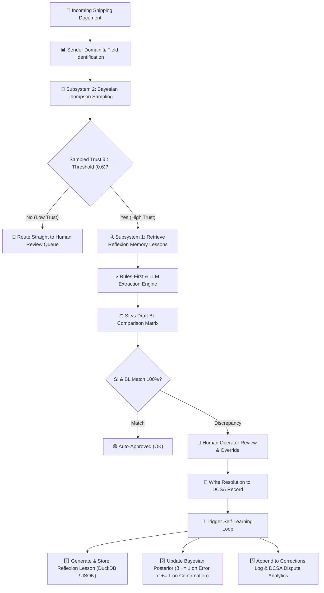

# DocuMatch Self-Learning Model & Reflexion Architecture Guide

---

## 📌 Executive Summary

DocuMatch features an **Online, In-Context Self-Learning Architecture** that continuously adapts to human feedback, carrier-specific document variations, and field discrepancies **without requiring model fine-tuning or weight retraining**.

The self-learning mechanism operates through three complementary subsystems:
1. **Reflexion Episodic Memory (Feature A)**: Synthesizes natural-language lessons from human operator overrides and injects them into future extraction prompts for the same sender domain.
2. **Bayesian Thompson Sampling Routing Policy (Feature B)**: Maintains a dynamic $\text{Beta}(\alpha, \beta)$ posterior trust distribution per sender/field to decide whether to process documents automatically or route them straight to human review.
3. **Reflexion Override Audit Log & Field Bank Learning**: Captures verbatim evidence, DCSA field attribution, and header variations to continuously refine terminology dictionaries.

---

## 🔄 Self-Learning System Architecture



---

## 🧠 Subsystem 1: Reflexion Episodic Memory (Feature A)

### Theoretical Foundation
Based on research by Shinn et al. (*"Reflexion: Language Agents with Verbal Reinforcement Learning"*, NeurIPS 2023, arXiv:2303.11366), Reflexion replaces traditional gradient-based model fine-tuning with **verbal reinforcement learning**. When the system makes an extraction mistake or encounters a human correction, it writes a natural-language "lesson learned" to an episodic memory buffer.

---

### 1. Generation of Reflection Lessons
When a human reviewer resolves a field discrepancy (e.g., selecting a custom value or overriding an AI proposal), `backend/services/reflection.py` triggers `generate_reflection()`.

#### Reflection Schema:
```json
{
  "id": "c7f21b8a-9d3e-4b1a-8e2f-5a6b7c8d9e0f",
  "sender_domain": "oceanictrade.com",
  "doc_type": "SI",
  "field_name": "shipper",
  "reflection_text": "When extracting shipper from oceanictrade.com SI documents, look for 'EAST BRIGHT FZ-LLC' in the document context instead of accepting 'OCEANIC TRADE LTD'. Verify keyword delimiters and line boundaries specific to oceanictrade.com's format.",
  "created_at": "2026-09-25T14:30:00Z",
  "source_correction_id": "email_055:shipper",
  "times_retrieved": 0
}
```

#### Generation Logic:
1. **LLM Generation**: If an LLM API key is configured, the system prompts the LLM to analyze the extraction mistake (`original_value` vs `corrected_value` + context excerpt) and generate a 1–3 sentence actionable advice for its future self.
2. **Deterministic Fallback Generator**: If no LLM API key is present (`LOCAL_PROVIDER`), the system synthesizes a structured actionable rule using template normalization:
   $$\text{Reflection} = \text{"When extracting } f \text{ from } d \text{ documents, look for } v_{\text{human}} \text{ instead of accepting } v_{\text{ai}}."$$

---

### 2. Episodic Memory Retrieval & Context Injection
When a new document arrives from `oceanictrade.com`:
1. `retrieve_reflections(sender_domain="oceanictrade.com", field_name="shipper", limit=3)` queries stored reflections ordered by recency.
2. The retrieved lessons are prepended into the extraction prompt or local rule evaluator:
   ```text
   [SYSTEM MEMORY / PAST LESSONS FOR oceanictrade.com]:
   - Lesson 1: When extracting shipper, look for 'EAST BRIGHT FZ-LLC' rather than header address lines.
   ```
3. **Counter Increment**: Each time a lesson is retrieved, its `times_retrieved` counter is incremented in DuckDB and `data/agent_reflections.json`.

---

## 🎲 Subsystem 2: Bayesian Thompson Sampling Routing Policy (Feature B)

### Mathematical Formulation
To dynamically decide whether a document from a specific sender should be processed automatically by AI or routed straight to a human operator, DocuMatch implements a **Multi-Armed Bandit with Beta-Bernoulli Thompson Sampling** (`backend/services/routing_policy.py`).

For each `(sender_domain, field_name)` pair, the system maintains a Beta distribution:

$$\theta \sim \text{Beta}(\alpha, \beta)$$

Where:
* $\alpha$ = Number of successful, human-confirmed AI extractions (Successes)
* $\beta$ = Number of human corrections / overrides (Failures)
* $\text{Mean Trust Score } E[\theta] = \frac{\alpha}{\alpha + \beta}$

---

### 1. Initial State (Uniform Prior)
When a sender domain is encountered for the first time:

$$\alpha_0 = 1.0, \quad \beta_0 = 1.0 \implies E[\theta_0] = \frac{1.0}{1.0 + 1.0} = 0.50 \text{ (50% Trust)}$$

---

### 2. Online Posterior Update Rule
Whenever a reviewer completes a document evaluation:

* **Case 1: AI Was Correct** (Human accepts AI/Rules value without change):
  $$\alpha \leftarrow \alpha + 1$$
* **Case 2: AI Was Incorrect** (Human overrides or corrects AI value):
  $$\beta \leftarrow \beta + 1$$

---

### 3. Thompson Sampling Routing Decision
For every incoming document:
1. Draw a random sample from the current posterior:
   $$\hat{\theta} \sim \text{Beta}(\alpha, \beta)$$
2. Compare sample $\hat{\theta}$ against the safety threshold $\tau = 0.6$:
   $$\text{Decision} = \begin{cases} \text{Route to AI Extraction Engine}, & \text{if } \hat{\theta} > 0.6 \\ \text{Route Straight to Human Queue}, & \text{if } \hat{\theta} \le 0.6 \end{cases}$$

#### Benefits of Thompson Sampling:
* **Exploration vs. Exploitation Balance**: Senders with high error rates ($\beta \gg \alpha$) are automatically shielded from AI processing, saving API token costs and preventing operator fatigue.
* **Instant Recovery**: As new positive outcomes occur, $\alpha$ increases, gradually restoring automated AI routing.

---

## 📊 Subsystem 3: Reflexion Audit Log & Field Bank Learning

### 1. DCSA-Attributed Correction Log (`corrections_log.py`)
Every human resolution is written to an append-only log (`data/corrections.csv`) formatted with **DCSA eBL Field Attribution**:

| timestamp | email_id | field | dcsa_field | original_value | corrected_value | resolution | reviewer | evidence_summary |
| :--- | :--- | :--- | :--- | :--- | :--- | :--- | :--- | :--- |
| `2026-09-25T14:30` | `email_055` | `shipper` | `shipper.partyName` | `OCEANIC TRADE LTD` | `EAST BRIGHT FZ-LLC` | `human_selected:custom` | `Pohyi Chong` | `SI@offset:124: EAST BRIGHT...` |

---

### 2. Field Bank & Normalization Learning (`field_bank.py`)
The `FieldBank` service resolves unmapped raw document headers using a multi-stage approach:
1. **NFKC Normalization & CJK/Latin Script Separation**: Converts Unicode variants and splits bilingual headers (e.g., `Shipper (发货人)`).
2. **Rapidfuzz Token Sort Ratio**: Matches ambiguous header strings against `data/field_terms.json` with an 85% similarity threshold.
3. **Runtime Candidate Harvesting**: Header labels falling below the 85% threshold are logged to `.runtime/term_candidates.csv` for term dictionary expansion.

---

## 📈 Summary of Self-Learning Capabilities

| Self-Learning Mechanism | Input Trigger | Primary Algorithm / Model | Storage / Persistence | Operational Benefit |
| :--- | :--- | :--- | :--- | :--- |
| **Reflexion Episodic Memory** | Human Reviewer Correction / Override | In-Context Verbal Reinforcement Learning | DuckDB `agent_reflections` + `data/agent_reflections.json` | Instant domain-specific extraction accuracy boost without model fine-tuning. |
| **Dynamic Routing Policy** | Reviewer Confirmation / Dispute | Beta-Bernoulli Thompson Sampling | DuckDB `routing_policy` + `data/routing_policy.json` | Automatically bypasses AI for error-prone senders, protecting human operators. |
| **DCSA Dispute Analytics** | Reviewer Resolution Log | DCSA Standard Field Attribution | `data/corrections.csv` | Tracks carrier field dispute rates to identify systemic carrier document errors. |
| **Field Bank Header Learner** | Unresolved Field Labels | Rapidfuzz Token Sort Matching + Candidate Logger | `.runtime/term_candidates.csv` | Continuously expands dictionary coverage for international shipping terms. |

---

## 🚀 Interactive Verification & Demonstration Scripts

To inspect or test the self-learning mechanism interactively:

```bash
# 1. Run interactive Reflexion Memory demonstration
python scripts/demo_self_learning.py

# 2. Run Trust & Circuit Breaker demo
python scripts/demo_trust_features.py

# 3. Run memory evaluation benchmark
python eval/evaluate_memory.py
```
