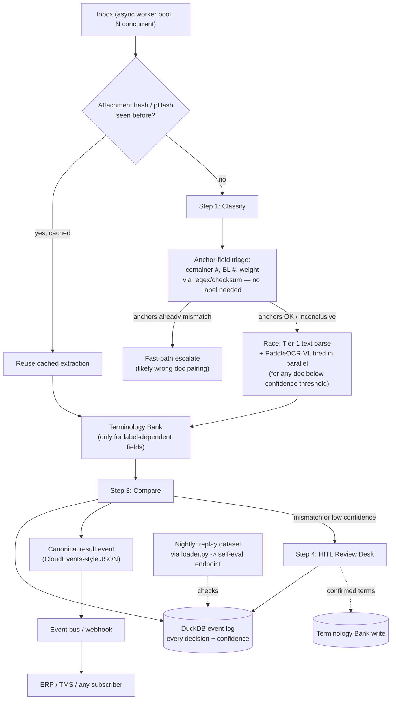

# Shipping Document Verification — Tech Desk v4
### Closing the v3 gaps (performance, reporting, integration, self-eval) + new shortcuts

---

## 1. What changed since v3 — gap closure

| Gap in v3 | Fix in v4 |
|---|---|
| Sequential fallback chain adds latency on hard documents | **Race-pattern extraction** (Section 3.1) — run cheap tiers in parallel instead of waiting for each to fail |
| No parallelism/caching/timeout across the inbox | **Async pipeline spec** (Section 4) |
| No reporting/BI | **Embedded analytics via DuckDB** (Section 5) |
| No ERP/TMS integration contract | **Event-driven output contract** (Section 6) |
| No tie-in to the brief's self-eval endpoint | **Continuous self-eval loop** (Section 7) |
| Everything routed through the Terminology Bank, even value-shaped fields | **Anchor-first / positional shortcuts** (Section 3.2, 3.3) bypass the bank entirely for fields that don't need it |

---

## 2. Updated Architecture Diagram

---

## 3. New shortcuts and unique techniques

### 3.1 Race-pattern extraction (replaces strict sequential fallback)
v3's Tier 1 → Tier 2 → Tier 3 chain is a *fallback*, meaning a hard document pays the latency
of every earlier tier failing before it reaches the one that actually works. Instead:
- Run a fast **confidence probe** on the text layer immediately after Tier-1 parsing (not "is
  it empty," but a real quality signal: % of tokens that are dictionary words in a detected
  language, or ratio of extractable field-shaped values found).
- If confidence is below a threshold, **fire Tier-1's partial result and PaddleOCR-VL in
  parallel** rather than waiting for Tier-1 to fully fail — take whichever returns a
  higher-confidence result first, and only escalate to a general vision-LLM if both come back
  low.
- This turns "three sequential stages of latency" into "at most two stages running
  concurrently," which matters directly for the "tons of inbox, need it fast" requirement.

### 3.2 Anchor-field-first triage (skip the whole language/label problem for some fields)
Container numbers, BL numbers, and gross weight are **value-shaped**, not label-dependent —
they can often be found by regex/checksum scan of the whole page without ever knowing what
language or word precedes them (ISO 6346 checksum for containers, SCAC-prefix pattern for BL
numbers, numeric-with-unit pattern for weight).
- Extract these anchors *first*, before running the full Terminology Bank pipeline.
- If the anchors already disagree between SI and BL (e.g., different container numbers
  entirely), that's often a sign of a **wrong document pairing** or **wrong shipment
  attached**, not a subtle field-label issue — fast-path this straight to human escalation
  with a `possible_wrong_pairing` reason code, skipping the rest of the extraction pipeline
  entirely. This both saves compute and gives the reviewer a more accurate escalation reason
  than "mismatch" would.
- If anchors agree, proceed to full extraction for the remaining label-dependent fields
  (shipper, consignee, notify party, ports) — these are the ones that actually need the
  Terminology Bank.

### 3.3 Positional/table-cell extraction as a Terminology Bank bypass
For carriers you've seen before, build a lightweight **template fingerprint** (detected via
carrier name/logo OCR or a BL-number prefix) that maps directly to fixed
coordinates/table-cell positions for each field. When a template match is found, read the
value at that position **without resolving the label at all** — the label's language becomes
irrelevant because you never look at it. Reserve the Terminology Bank for new/unrecognized
carriers and freeform freight-forwarder documents only.

### 3.4 Perceptual hashing for scanned duplicates (beyond exact-content caching)
v3 mentioned content-hash caching for exact duplicate attachments. Extend this with
**perceptual hashing (pHash)** on scanned pages: catches the case where the *same* BL is
resent as a slightly different scan (re-photographed, re-compressed, or with a stamp added on
resend) — an exact byte hash would miss this, but a perceptual hash still matches it,
letting you skip a second full OCR/extraction pass.

### 3.5 Semantic caching for LLM/embedding disambiguation
Rather than caching Tier-C (LLM) disambiguation results only by exact term string, cache by
**embedding cluster**: if a new never-seen term embeds very close to a term already resolved
for a *different* client, reuse that resolution as a staged suggestion rather than triggering
a fresh LLM call. This spreads the benefit of every LLM call across all clients, not just the
one that triggered it — compounding the "AI cost trends to zero" effect from v3 faster.

---

## 4. Performance architecture (the piece missing from v3)

- **Async worker pool**: each email + its attachments is processed as an independent unit;
  concurrency is bounded only by downstream rate limits (e.g., LLM API), not by inbox size.
- **Attachment-level caching**: keyed by content hash (exact) and pHash (near-duplicate) —
  covers retries, resends, and re-scans.
- **Per-email timeout with auto-escalation fallback**: if any single email's pipeline exceeds
  a budget (e.g., 8–10 seconds), it's escalated to human review with whatever partial result
  exists, rather than blocking the batch.
- **Streaming results**: each email's result is emitted the moment it's ready, so the review
  queue and any downstream subscriber start receiving results immediately rather than waiting
  for the full inbox batch to finish.

---

## 5. Reporting & analytics — the unique shortcut: embedded OLAP, not a BI platform

Rather than standing up a data warehouse or BI tool (the heavy default most vendors push
toward), log every pipeline decision as a row — classification scores, extraction tier used,
confidence, anchor-triage outcome, diff result, escalation reason — into **DuckDB**, an
embedded analytical database that queries flat files/Parquet directly with no server to run.
- Free, zero infrastructure, and fast enough to answer things like "mismatch rate by field
  this month" or "which carrier's documents escalate most often" with a single SQL query
  against the log file.
- This directly answers the "custom analytics/BI is weak" industry pain point you flagged,
  without building or licensing a BI stack.

---

## 6. Integration — event-driven contract instead of point-to-point adapters

Rather than building a bespoke connector per downstream ERP/TMS (the "higher paid tier /
integration friction" pain point), emit each result as a **canonical event** (a CloudEvents-
style JSON envelope: event type, source, timestamp, payload = the same `email_id`-keyed
comparison result the brief already specifies) onto a lightweight event bus or even a plain
webhook. Any downstream system — ERP, TMS, a spreadsheet, a Slack alert — subscribes to the
same event stream instead of needing a custom integration written against your internals.
Adding a new downstream consumer becomes "point it at the event stream," not "write a new
adapter."

---

## 7. Continuous self-evaluation loop (tying back to the actual brief)

The brief provides `loader.py`, `sample_submission.json`, and a self-evaluation endpoint
specifically so accuracy can be measured against a private reference set while building. v4
adds this as a first-class, recurring step, not an afterthought:
- **Nightly (or per-deploy) job**: replay the full dataset through the pipeline, format
  output per the required `email_id`-keyed schema, and submit via `inbox.submit(...)`.
- **Track the scoreboard over time**, not just once — a regression in classification or
  comparison accuracy after a change should show up immediately, the same way a test suite
  would catch a code regression.
- **Cross-reference escalations against the scoreboard**: cases the self-eval flags as wrong
  should be checked against source documents before "fixing" anything, per the brief's own
  guidance — this loop is where that check actually happens on a schedule instead of
  ad hoc.

---

## 8. Updated Summary Table

| Layer | Technique | Solves |
|---|---|---|
| Ingestion | Async worker pool, content-hash + pHash caching | Volume/throughput, duplicate resends |
| Triage | Anchor-field-first (container/BL#/weight via regex+checksum) | Skips label-language problem for value-shaped fields; catches wrong-pairing fast |
| Extraction | Race-pattern (parallel Tier-1 + PaddleOCR-VL) instead of sequential fallback | Tail latency on hard documents |
| Extraction (templated) | Positional/table-cell matching per known carrier | Bypasses Terminology Bank entirely where possible |
| Label resolution | Terminology Bank (bank → BGE-M3 → LLM, staged/governed) | Multilingual field-label ambiguity, only when truly needed |
| Reliability | Per-email timeout + auto-escalate, streaming results | No single document stalls the batch |
| Reporting | DuckDB embedded analytics on the decision log | BI/analytics gap, zero infra |
| Integration | CloudEvents-style event bus / webhook | ERP/TMS integration friction |
| Accuracy assurance | Nightly self-eval replay against the brief's endpoint | Closes the loop the brief actually asks for |

---

## 9. Rollout Phasing

1. **Phase 1** — Async pipeline + hashing/caching + per-email timeout (unblocks throughput
   immediately, independent of everything else).
2. **Phase 2** — Anchor-field-first triage + positional/template matching (cuts Terminology
   Bank and LLM load before it's even built).
3. **Phase 3** — Terminology Bank (seed → embedding fallback → staged LLM), as in v3.
4. **Phase 4** — Race-pattern extraction + semantic caching for the hardest scanned documents.
5. **Phase 5** — DuckDB reporting layer + CloudEvents integration contract.
6. **Phase 6** — Nightly self-eval loop wired to the brief's `loader.py`/submission endpoint,
   running continuously from here on.

Each phase is independently shippable and none require rewriting `classifier.py`,
`comparator.py`, or the existing HITL desk.
